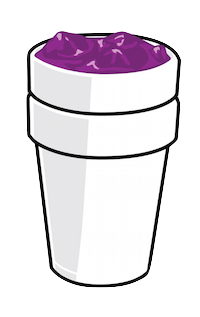

lean.js (1.0.0)
=========



A micro-library (2kb) to lazy load and import Web Components.

## Features
* Synchronous module injection
* HTML Support

## Functions
<dl>
<dt><a href="#inject">inject(file)</a> ⇒ <code>string</code></dt>
<dd></dd>
<dt><a href="#require">require(file)</a> ⇒ <code>DOMElement</code></dt>
<dd></dd>
</dl>
<a name="inject"></a>
## inject(file) ⇒ <code>string</code>
**Kind**: global function
**Returns**: <code>string</code> - - returns name of html file as a document create consumable name.

| Param | Type | Description |
| --- | --- | --- |
| file | <code>string</code> | a http file path. |

**Example**
```js
// injects file if needed and returns DOMNode  <todo-widget></todo-widget>
 var name = lean.inject('./widgets/todo-widget.html');
 var todoWidget = document.createElement(name);
 var anotherWayTodoWidget = document.createElement('todo-widget');
```
<a name="require"></a>
## require(file) ⇒ <code>DOMElement</code>
**Kind**: global function
**Returns**: <code>DOMElement</code> - - HTML Imports return a createdDOM Element the import. This will execute the 'createdCallback' or 'created' function in the Web Component.

| Param | Type | Description |
| --- | --- | --- |
| file | <code>string</code> | a http file path. |

**Example**
```js
// injects file and returns DOMNode  <todo-widget></todo-widget>
 var todoWidget = lean.require('./widgets/todo-widget.html');
// won't inject file since injected above, and just create new element and require
 var todoWidgetAgain = lean.require('./widgets/todo-widget.html');
```

## Requirements

* This module will only test evergreen browsers (latest versions).
* This project does not require `Polymer`, but does require Web Components to be enabled. See `webcomponents-js` for a shim.
* Dynamic names not support yet.

## Possible Use Cases

### Lazy Loading for:

* **Conditional builds**: inject files based on any conditions, whether browser type or user event.
* **Large Scale Ecosystem apps**: Lazy load modules like widgets as you need them.

## Design Goals

#### Primary Goals
1. Extremely Simple API 
2. Keep it small.
3. Keep it fast.
4. Properly tested.

#### Design decisions to achieve goals
* Use simple injection techniques. (Simple script loads) [2] [3]
* Allow instant usage of web component if desired. [2] [1]
* Support only evergreen browsers [2] [3]

## Roadmap

#### 1.0.0 [production release]
* Write tests
* Hook into OSS devops services

#### 1.1.0
* Emit events on module loads for loading screen integration.

#### Backlog
* Async stream loading